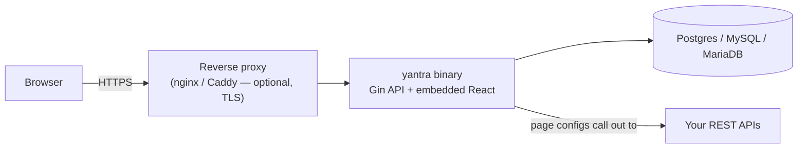

# Yantra

Open-source, self-hosted internal-tool platform with first-class governance — RBAC,
audit logging, and SSO built in, free, from day one. Deploy with one command. Your
data never leaves your infra.

> **V1 has no visual page builder.** Pages (data tables, forms) are defined via a
> YAML config editor in the admin UI, not drag-and-drop. See [PRD](PRD/PRD_v0.3.md).

## Architecture

One process, one Docker image: the Go binary serves the REST API and the compiled
React app (embedded at build time), talking to a single Postgres/MySQL/MariaDB
database.



## Project structure

```
Yantra/
├── backend/                 Go module — the entire server
│   ├── cmd/yantra/           main.go: wires config, DB, routes, embedded frontend
│   └── internal/
│       ├── models/            GORM structs — the DB schema
│       ├── repositories/       one per table/aggregate, thin DB access
│       ├── services/           business logic (auth, permissions, users, audit)
│       ├── handlers/           HTTP layer (Gin handlers + route registration)
│       ├── middleware/         auth, setup-guard, permission checks, trusted proxy
│       ├── crypto/             AES-256-GCM (secrets) + bcrypt (passwords)
│       └── webui/              embeds the built frontend (go:embed)
├── frontend/                 React + TypeScript + Vite
│   └── src/
│       ├── routes/             one file per screen
│       ├── components/         shared UI pieces
│       └── lib/                api client, auth context, route guards
├── docker-compose.yml         one-command deploy (bundles Postgres)
├── Dockerfile                 3-stage build: frontend → embed → runtime image
├── .env.example                every config variable, documented
└── PRD/PRD_v0.3.md             the product spec this is built from
```

## Install (Docker — recommended)

Needs [Docker](https://docs.docker.com/get-docker/) with Compose. No Go, Node, or
database installation required — everything runs in containers.

```bash
git clone https://github.com/imsurajsn/Yantra.git
cd Yantra
cp .env.example .env
```

Open `.env` and set `APP_SECRET` (used to sign sessions and encrypt secrets at
rest — the app refuses to start without it):

```bash
./scripts/generate_secret.sh   # prints a random value; paste it in as APP_SECRET
```

Also set `POSTGRES_PASSWORD` in `.env` to a real password (it defaults to a
placeholder). Everything else in `.env.example` has a working default for the
bundled Postgres setup.

Start everything:

```bash
docker compose up --build
```

Open **http://localhost:8080** — you'll land on the first-run setup screen. Create
the admin account, sign in, and you're running.

To stop: `docker compose down` (data persists in a Docker volume; add `-v` to also
wipe the database).

## Local development (without Docker)

See [CONTRIBUTING.md](CONTRIBUTING.md) — needs Go 1.25+, Node 22+, and a local
Postgres.

## License

[AGPL-3.0](LICENSE) — see the PRD's [competitive positioning](PRD/PRD_v0.3.md) for
why.
